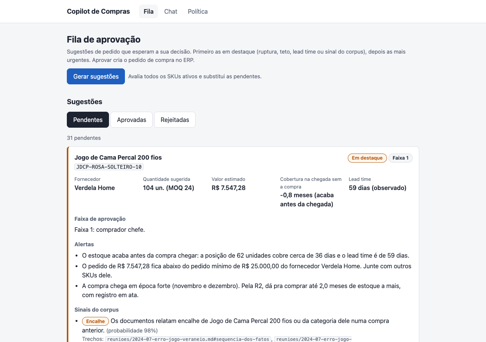

# Roteiro de demo

Roteiro de 5 a 8 minutos que mostra o Copilot de Compras de ponta a ponta, no lugar de um vídeo. Cada passo tem o comando ou a tela, o que mostrar e o que esperar. Os números abaixo saíram do ambiente local em 2026-10-01 (seed, corpus ingerido, Jev `jev-1.13.0` e redator da Groq) e mudam com a data em que o seed rodou e com a política ativa. Vocabulário em [`CONTEXT.md`](../CONTEXT.md).

## Pré-requisitos

- Docker com `docker compose`, [`uv`](https://docs.astral.sh/uv/), `curl`, [`jq`](https://jqlang.org/) e um navegador.
- `.env` copiado do `.env.example`, com a `JEV_KEY` (TypeSafe). Sem ela, a busca, os sinais, o chat e a geração da fila respondem 503.
- Uma chave de redator, opcional: `ANTHROPIC_API_KEY` (Claude) ou `GROQ_API_KEY` (Groq). Sem nenhuma, o chat responde com os dados que reuniu, sem redação. Na Groq gratuita, espere um minuto entre as perguntas do chat (8.000 tokens por minuto; uma redação pede uns 3.100).

## Preparação (antes de apresentar, uns 5 minutos)

```bash
docker compose up -d                       # Postgres (pgvector) e o app em http://localhost:8000
uv run alembic upgrade head                # migrations até a 0008
uv run python -m scripts.seed              # ERP fake reprodutível (apaga e recria o schema erp)
uv run python -m scripts.ingerir_corpus    # corpus no pgvector (baixa o modelo de embedding na primeira vez)
curl -s -X POST http://localhost:8000/sugestoes/gerar | jq '{geradas, substituidas, skus_avaliados, sinais_indisponiveis}'
```

A geração da fila leva uns 40 s (80 SKUs, uns 800 requests do Jev) e substitui as pendentes. Esperado: `geradas` 31, `skus_avaliados` 80, `sinais_indisponiveis` falso. Para começar do zero, veja "Resetar o ambiente local" no [README](../README.md#resetar-o-ambiente-local).

Deixe abertas a fila (`http://localhost:8000/ui/`) e o chat (`http://localhost:8000/ui/chat.html`).

## Passos

### 1. A ficha de um SKU, sem IA (30 s)

```bash
curl -s http://localhost:8000/skus/TBC-BEGE-70140-01/analise | jq '{produto_nome, estoque: .estoque.quantidade_disponivel, giro: .giro.unidades_por_mes, cobertura: .cobertura.meses, fornecedores: [.fornecedores[].fornecedor_nome]}'
```

Mostrar: o Copilot já é útil sem IA. Esperado: Toalha Banho Conforto com 180 unidades, giro de uns 127 por mês (média de 6 meses), cobertura de 1,4 mês e dois fornecedores (Katrina Têxtil e Aurora Home Center).

### 2. A sugestão determinística, com a memória de cálculo (45 s)

```bash
curl -s http://localhost:8000/skus/TBC-BEGE-70140-01/sugestao-compra | jq '{quantidade, fornecedor: .fornecedor.fornecedor_nome, calculo, alertas: [.alertas[].mensagem], politica_versao}'
```

Mostrar: a conta é do código, com os parâmetros da política de compra ([ADR-0003](adr/0003-politica-de-compra-configuravel.md)). Esperado: 213 unidades da Katrina; no `calculo`, posição 180 (nada em trânsito), lead time observado de 33 dias, estoque previsto na chegada de uns 41 e cobertura na chegada de 2,0 meses; alertas de pedido abaixo do mínimo do fornecedor e de chegada em época forte (R2); `politica_versao` diz com que versão da política a conta foi feita.

### 3. A busca no corpus com o filtro do Jev e o conflito da Katrina (1 min)

```bash
curl -s -G http://localhost:8000/rag/busca --data-urlencode "q=lead time da Katrina" \
  | jq '{classificacoes: (.trechos | group_by(.classificacao) | map({(.[0].classificacao): length}) | add), aceitos: [.trechos[] | select(.classificacao == "aceito") | .id], conflitos}'
curl -s http://localhost:8000/skus/TBC-BEGE-70140-01/sugestao-compra/sinais | jq
```

Mostrar: a busca vetorial traz 30 trechos e o Jev decide trecho a trecho ([ADR-0002](adr/0002-jev-decide-codigo-executa-llm-redige.md)); o código classifica com limiares. Esperado: 8 aceitos e 22 descartados, entre os aceitos a ficha `#lead-time` (prometido 45, observado 55-65 dias), a cláusula 3 do contrato e a revisão Q1/2025 (62 dias). Em `conflitos`, um par: a justificativa do Natal 2024 ("passou de 45 pra 68 dias") contra as notas internas do contrato ("cumprida em setembro-outubro"), com probabilidade entre 0,54 e 0,60 (variou entre duas execuções).

Ser honesto aqui: o conflito canônico do `CONTEXT.md`, a cláusula 3 (45 dias) contra a revisão Q1 (62 dias), **não** aparece. Os dois trechos estão aceitos, mas o Jev dá uns 0,12 ao par, abaixo do limiar de 0,40 calibrado no M8. O atraso da Katrina chega ao comprador por outro caminho: o segundo comando devolve o sinal `atraso_do_fornecedor` (0,96) com três trechos de origem, inclusive a justificativa do Natal.

### 4. O chat com uma sugestão que traz sinal e citações verificadas (1 min 30 s)

No chat (`/ui/chat.html`), pergunte "Quanto devo comprar do SKU TBC-BEGE-70140-01?", ou:

```bash
curl -s http://localhost:8000/chat -H 'Content-Type: application/json' \
  -d '{"pergunta": "Quanto devo comprar do SKU TBC-BEGE-70140-01?"}' \
  | jq '{resposta, acao, faixa, intencao: .entendimento.intencao, sinais: [.sugestoes[].sinais[]?.tipo], citacoes: [.citacoes[] | {trecho_id, veredito, confianca}], redator}'
```

Mostrar: o Jev entende a pergunta (`sugestao_compra` com 1,00, faixa alta), o código calcula a sugestão e os sinais, o LLM só redige e o Jev confere cada citação. Esperado: a resposta começa pela quantidade (213 unidades da Katrina, "o fornecedor escolhido pela política"), repete a memória de cálculo e os alertas sem converter nem comparar números, fala do sinal de atraso com um trecho de origem por frase (ficha `#lead-time`, revisão Q1 e justificativa do Natal) e termina com "A decisão sobre a quantidade e o fechamento do pedido é sua". Na execução de referência, com o Claude (`anthropic:claude-opus-5-5`), as três citações saíram `confirmada` com confiança 1,00, em uns 16 s. Com a Groq, a resposta vem em uns 5 s e o texto muda de uma execução para outra; na Groq gratuita, se o limite de tokens estourar, a resposta vem sem redação (ver "Se algo der errado").

Na tela do chat, mostre também o painel "o que o Copilot entendeu" (intenção, confiança, faixa, ação, SKUs), a sugestão com o sinal e a lista de citações com o veredito. Citação que não se confirma aparece marcada no texto, como `[<id> - não confirmada]`.

### 5. Uma pergunta que pede esclarecimento (30 s)

No chat, pergunte "Quanto sobrou de toalha de rosto 45x70 no estoque?", ou:

```bash
curl -s http://localhost:8000/chat -H 'Content-Type: application/json' \
  -d '{"pergunta": "Quanto sobrou de toalha de rosto 45x70 no estoque?"}' \
  | jq '{resposta, acao, faixa, identificacao, redator}'
```

Mostrar: quando o código não consegue identificar o SKU, ele devolve a pergunta ao comprador, sem ler dados nem chamar o redator. Esperado: `pediu_esclarecimento`, `redator` nulo, resposta em menos de 0,5 s: "Não identifiquei o produto no catálogo. Informe o código do SKU (ex: TBC-BEGE-70140-01) ou o nome do produto. Você quer dizer Toalha Rosto Conforto?" (a 45x70 não existe no catálogo). O outro caminho de esclarecimento, a intenção com confiança abaixo de 0,50, ficou raro depois dos critérios do M8: nas 45 perguntas rotuladas, nenhuma caiu na faixa baixa.

### 6. O registro de decisão (45 s)

```bash
curl -s "http://localhost:8000/chat/registros?limite=2" | jq '[.[] | {pergunta, intencao, confianca, faixa, acao, skus, redator, duracao_ms, sinais, citacoes: [.citacoes[].veredito]}]'
uv run python -m scripts.relatorio_registros
```

Mostrar: toda resposta do chat grava um registro de decisão para auditoria e calibração: a pergunta, o entendimento com as probabilidades, a faixa, a ação, os SKUs, o redator, a duração, os sinais e o veredito de cada citação. Esperado: os dois registros dos passos 4 e 5, do mais recente para o mais antigo (o esclarecimento em uns 400 ms, sem redator; a sugestão com o sinal de atraso e três `confirmada`). O relatório resume o registro inteiro: confiança por intenção, faixas, ações, perguntas repetidas com a dispersão da confiança (o "Qual o lead time de verdade da Katrina?" aparece com intenções diferentes antes e depois do M8), redator, durações, vereditos e sinais. Foi com ele que o M8 revisou as faixas de confiança.

### 7. A fila com destaque e a aprovação que vira pedido no ERP (2 min)

Na fila (`/ui/`, imagem abaixo), mostre a contagem de pendentes, o primeiro card em destaque e, dentro dele, a faixa de aprovação, os alertas, os sinais do corpus com os trechos e a memória de cálculo recolhida.



Antes de aprovar, guarde o em trânsito do SKU do primeiro card e consulte a faixa de uma quantidade editada:

```bash
ID=$(curl -s http://localhost:8000/sugestoes | jq -r '.[0].id')
SKU=$(curl -s http://localhost:8000/sugestoes | jq -r '.[0].sku_code')
curl -s http://localhost:8000/skus/$SKU/sugestao-compra | jq '{quantidade, em_transito: .calculo.em_transito}'
curl -s "http://localhost:8000/sugestoes/$ID/faixa?quantidade=312" | jq
```

Esperado: 31 pendentes, 10 em destaque (ruptura antes da chegada ou violação do teto, os motivos de destaque padrão da política). O primeiro card é o `JDCP-ROSA-SOLTEIRO-10` (Verdela, 104 unidades, faixa 1, cobertura na chegada sem a compra de -0,8 mês, sinal de encalhe pelo jogo Veraneio). Com 312 unidades, a faixa vira a 3 (viola o teto e sobe uma faixa) e exige justificativa: é o aviso que a UI mostra ao editar a quantidade.

Aprove na tela, com a quantidade sugerida (o botão "Aprovar" abre o formulário com o nome), ou:

```bash
curl -s -X POST http://localhost:8000/sugestoes/$ID/aprovar -H 'Content-Type: application/json' \
  -d '{"aprovado_por": "Comprador chefe"}' | jq '{status, pedido_compra_id, quantidade_aprovada}'
curl -s http://localhost:8000/skus/$SKU/sugestao-compra | jq '{quantidade, motivo, em_transito: .calculo.em_transito}'
```

Esperado: a sugestão sai `aprovada` com o `pedido_compra_id` do pedido `aprovado` criado em `erp.pedidos_compra`, e a próxima sugestão do SKU já conta as 104 unidades como em trânsito (quantidade menor ou zero com motivo). É o único caminho da API que escreve no ERP, e só a aprovação humana chega a ele.

### 8. O onboarding gravando uma versão nova da política (1 min)

Abra `/ui/politica.html`: cada pergunta, na linguagem do comprador, vem preenchida com o valor da versão ativa.


Mude uma resposta (por exemplo, a pergunta 1, de 3 para 4 meses) e salve. Depois:

```bash
curl -s http://localhost:8000/politica-compra | jq '{versao, criada_em, teto_meses: .parametros.teto_meses}'
```

Esperado: a versão ativa sobe uma, com o valor novo. A fila só muda quando for gerada de novo, e cada sugestão guarda a versão da política com que foi calculada.

## Se algo der errado

- 503 na busca, nos sinais, no chat ou na geração: falta a `JEV_KEY` ou o Jev está fora do ar.
- O chat abre com "O LLM que redige a resposta está indisponível no momento": o redator caiu (na Groq gratuita, em geral um 429 por tokens por minuto) e a resposta saiu sem redação. Espere um minuto e pergunte de novo.
- Fila vazia: rode o `POST /sugestoes/gerar` da preparação.
